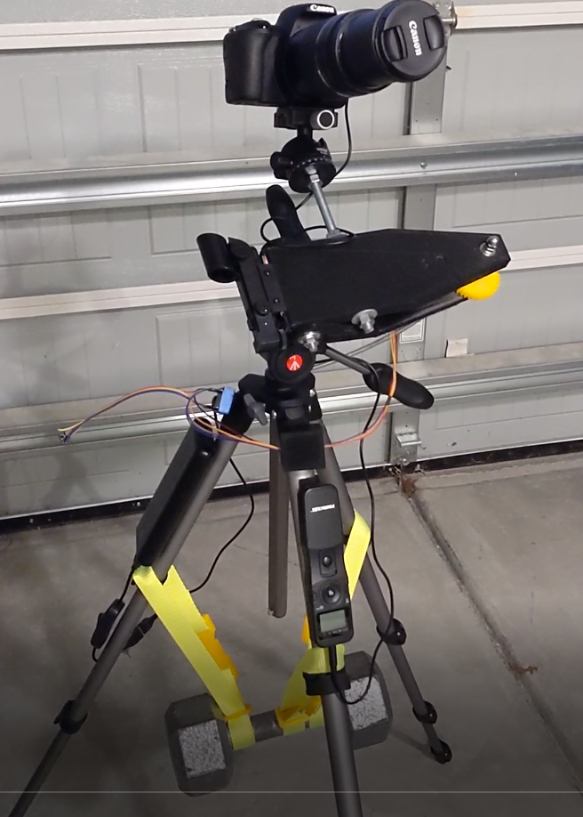

When taking pictures of the stars you will get star trails if you don't compensate for the earth's movement.  In some cases this may be a desired shot!  It can be a pretty cool picture.  But for deep sky imaging it's not desired.

I am just getting into astrophotography.  I know it can be expensive to buy gear and I don't know, well, anything yet.  To get started and start learning I made a couple prototype isosoles [barn door trackers](https://en.wikipedia.org/wiki/Barn_door_tracker), one mechanical and one motorized like this, to prove it works.  Then I decided to get more precise and 3D print things.

All docs are in `docs/` and there is an [Index](docs/00-index.md).  My goal is to write up everything you need in order to print, assemble, and use this tracker.  Hope you find some value in this!

Clear Skies!

## Tracker Explained

Posted an 8 min video giving an overview of my setup.

## Tracker in Action

All setup and ready to go.  Battery on left leg, intervalometer on right, and 15 lb weight in the backpack.

## [Orion Nebula](https://www.astrobin.com/4iprt9/) 

Canon EOS Rebel SL2, 300mm Lens, ISO1600 
866 x 5 second lights (1 hr 12 min 7 sec) 
[DeepSkyStacker](http://deepskystacker.free.fr/english/index.html) and [GIMP](https://www.gimp.org/).

## [Flame and Horsehead Nebulas](https://www.astrobin.com/a59dnw/) 

Canon EOS Rebel SL2, 300mm Lens, ISO3200 
621 x 5 second lights (50 min 50 sec) 
[DeepSkyStacker](http://deepskystacker.free.fr/english/index.html) and [Affinity Photo](https://affinity.serif.com/en-us/photo/).
