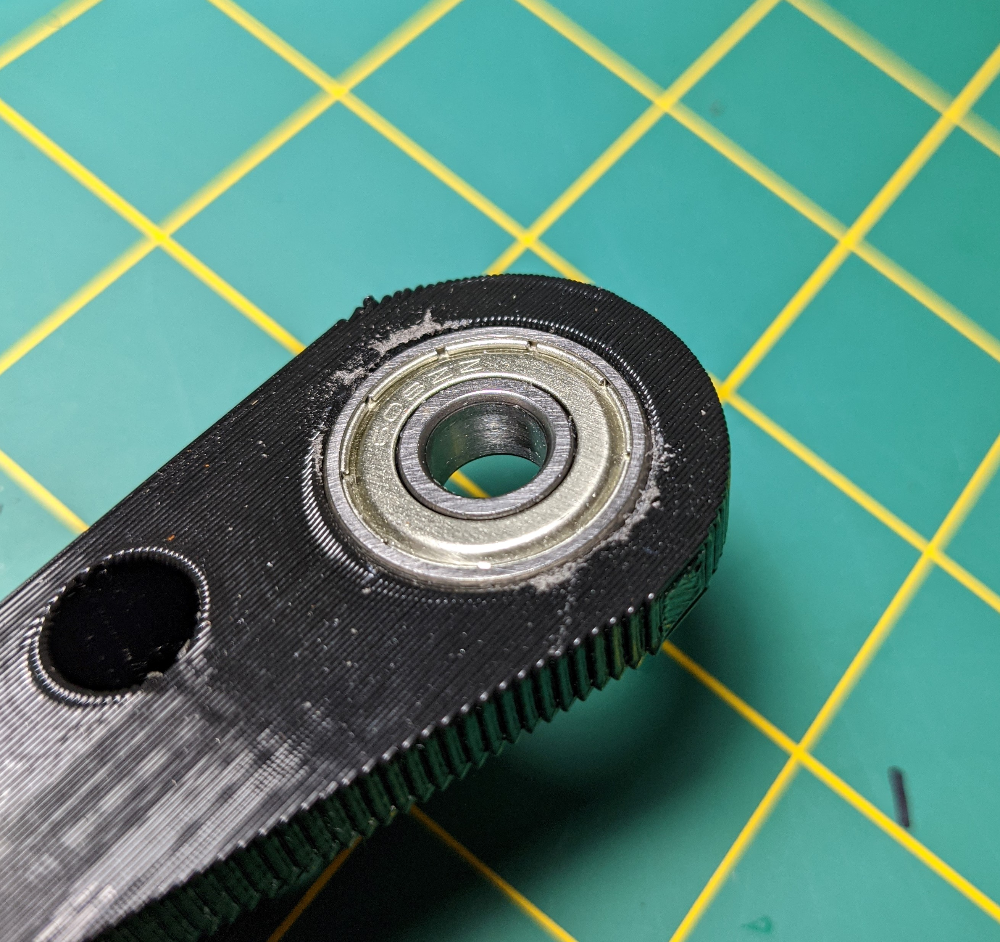

# Assembly

Follow the sub-sections in order...

## Prep: Sanding / Filing

1. Make sure the bottom plate is smooth where the 43 tooth gear will rest.
1. Make sure the bottom plate's rod hole is smooth but don't make it too wide!
1. Cleanup the bottom plate bearing support.  Don't get it so the bearing can be hand pressed in, you can do that with the bolt and a few larger washers.  Cleanup both sides EVENLY if possible!
1. Cleanup teeth on all gears.  Do not take off much material but make sure there are no odd protrusions that will cause gears to push each other and move the tracker.
1. Cleanup the inside of the stepper gear so it fits on the stepper motor.
1. Generally cleanup anything else.. 

## Bearings

Gently press the bearings into the bottom plate.  Be sure to put the pressure on the outer bearing race, not the inner, else you may damage the bearing.  It shouldn't be too hard to press it in, so if it's really hard cleanup some with a file or sandpaper.

To press them in stach washers such that the biggest washer is on the outer race and the hinge bolt won't slip through it.  Use washers on both sides.  Gently screw the bolt onto the bearing with the nut you have for the hinge.  

Remove bolt and repeat for the other bearing.

Here are some example pictures of me testing this process on the hardware test print.  Note this doesn't have the simple finder test print.  Flip the bolt around the other direction if that bumps into the bolt.

## Hinge Bolt

Make sure you get the right orientation for the plates.  When closed, the sides that were on your print bed are on the outside!

Note I am adding some 1/4" washers to ensure the bolt and nut have a solid and flat surface on the outside of the bearing.  This is not required.

Then...
1. Place the top plate in between the bearings in the correct orientation. 
1. Place one 1/4" washer on the 5/16" hex head bolt.
1. Thread 5/16" hex head bolt through one bearing.
1. Push or thread bolt through the top plate.
1. Add one 1/4" washer on the bolt.
1. Gently tighten.  This may mean tightening the bolt head if threaded through the top plate AND tightening the 5/16" nut.
1. Check alignment of the threaded rod holes between top and bottom.

### Troubleshoot

If the rod holes do not align it's probably due to over extrusion and filling away material inconsistently between the two bearing holes.  Mine was off by at least 1mm resulting in a huge misalignment at the end of the tracker.

I don't know what I did wrong but whatever.  Going to make it work!  My solution was to find which hole needed adjustment and slowly sanding with 80 grit sandpaper on a dowel.  The side effect of this was a gap on the back side of one bearing.

Create and print the [mini-wedge.stl](src/stl/mini-wedge.stl) and if needed adjust with the [mini-wedge.scad](src/scad/mini-wedge.scad).  Put in wedges as needed, glue in, and cut flush.  Do this after sanding and with your straight (not yet curved I assume) threaded rod inserted into both the top and bottom plates.  The closer you get this to perfect the better!  Which is why I'm bummed I had to write this section.  But it is what it is!

## Stepper Gear

You may have to push the 10 tooth gear onto the stepper motor.  But if you have to push really hard STOP.  Take the time to file down the inside.  You'll need some small hobby files, but if you have a 3D printer you should get some anyway.  Once it fits down snug but not too snug thread the #6 set screw into one side of the gear.  Optionally use a second #6 set screw.

**NOTE** take care to note if the stepper gear is tilted.  This is easier to do powered, since you can simply eyeball a full rotation and see if it seems the teeth wobble over the course of a rotation.

## Stepper (with Gear)

Thread 2 #8-32 x 1" machine screws through the motor mounts into the 2 holes on the bottom plate.  Of course the gear must go UP into the bottom plate, so you can't get the orientation wrong unless you try really **really** hard..

Slide stepper as close to hinge as possible and **loosely** tighten bolts with #8-32 nuts, optional washers.  We will adjust the stepper location in a later step, but it's much easier to install before the threaded rod is on the tracker.

## Threaded Rod and Gear

For now just a quick summary.  More info to come..
1. Bend the rod.
1. Open tracker.
1. Secure to top with washers, lock washers, and nuts (1 ea top and bottom).
1. Install 43 tooth gear (with nuts).
1. Thread end of curved rod into bottom plate.
1. If necessary, bend AT THE TOP PLATE to get it to fit in the bottom plate.  Do not remove any curve!
1. Thread 1/4" cap nut on end of the curved rod.

**NOTE** Once you install this on a tripod you may find it is too long, interfering with tripod legs.  You'll get hours of time out of this even shortening it a lot.  Feel free to cut short with a hack saw, smooth out the threads, and put the nut cap back on.

## Adjust Stepper

With the threaded rod gear near the end of the curved rod..

Loosen the stepper bolts and slide it so that the stepper gear is interacting with the threaded rod gear where you want.  This may take some tuning to make sure it's not too loose or tight a fit.

**NOTE** imperfections in the gears may cause things to move around while taking shots.  If you notice things binding see if you can smooth any of the gears or adjust the distance between the stepper and threaded rod gears.

## Camera Bolt

Thread or push your 3/8" bolt through the camera bolt hole.  Tighten as needed.  Attach camera mount on the polar said of the tracker.

If this bolt is very long the whole thing will bounce more.  Using a 3/8" threaded rod for this allows you to adjust the length by changing how long the rod is on the camera (polar) side.

1. install one washer and nut
2. insert rod into camera hole
3. install other washer and nut
4. adjust location based on where you think you want the camera mount
5. tighten
6. thread one more nut
7. install camera mount
8. lock camera mount by tightening last nut on the base of the camera mount

Be careful not to tighten the nut too much on the camera mount.  Unless you got a really nice one (you didn't did you..) you could break the threads off of the mount.

## Tripod Bolt

This is specific to your tripod.  You may need to replace the bolt you have on the tripod with something longer.  Whatever you have, thread it through the bottom plate hole and secure with a nut.  Consider a T-nut and a shorter bolt if you don't want it protruding.  The T-nut requires a wider hole and could be pressed in after heating (so the tines will melt the plastic when being pushed).

Note my bolt is too long and I plan to cut it short and heat a T-nut to secure it.  Just do what is right for your setup..

## Other Electronics

The drive controller and Raspberry Pi installation I leave to you.  Just make sure:
1. lights on these will not interfer with your pictures
1. the threaded rod will not hit them
1. they are in a good location when the tracker is both fully closed AND fully open

