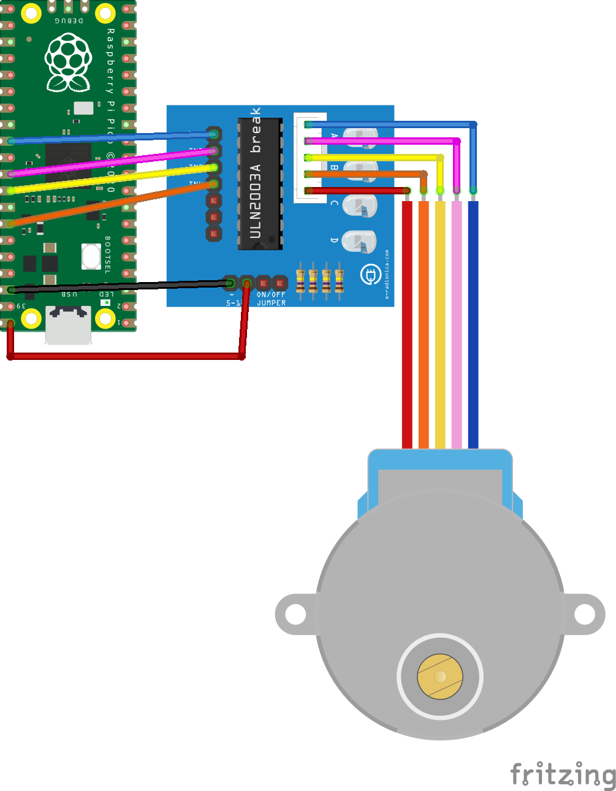
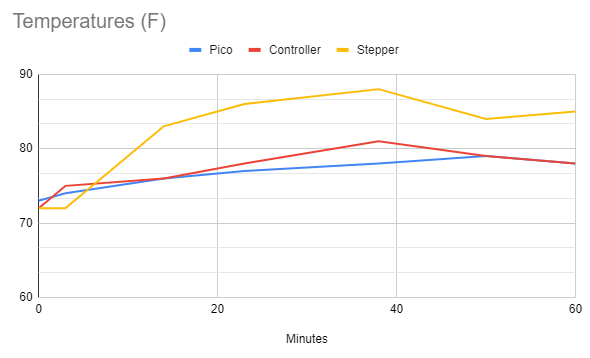

# Code

I staretd out developing this for a Raspberry Pi 4b.  The code is still there (see [stepper.py](../src/python/stepper.py)) but I have moved on to the Raspberry Pi Pico which is a little different.  This document assumes:

- You are using a Raspberry Pi Pico
- You are wiring it the same way documented here
- You can change the code if you use another device or wire it differently

# Raspberry Pi Pico

- File: [main.py](../src/microPython/main.py)
- Config: [stepper.yaml](../src/microPython/stepper.yaml)

The code doesn't hard wire pins but you do have to configure it.  See the [Calibration](#calibration) section on why you don't need to tune the stepper delay.

So just plug in your configuration in [stepper.yaml](../src/microPython/stepper.yaml) and ship the [microPython](../src/microPython/) directory to your Raspberry Pi Pico.

How?  I will leave that to you but provide the tools I used.  I decided to go the VSCode route which is GREAT!  I have one IDE to manage the code, run it remotely on the Pico, and finally to upload it to the Pico.  The sites I found helpful:

- [Raspberry Pi Pico: Getting Started](https://www.raspberrypi.org/documentation/pico/getting-started/)
- [How To Solder Pins to Your Raspberry Pi Pico](https://www.tomshardware.com/how-to/solder-pins-raspberry-pi-pico)
- [Developing for the Raspberry Pi Pico in VS Code — Getting Started](https://medium.com/all-geek-to-me/developing-for-the-raspberry-pi-pico-in-vs-code-getting-started-6dbb3da5ba97)
- [MicroPython libraries](https://docs.micropython.org/en/latest/library/index.html)

Once you get everything uploaded to the Pico it pretty much instantly starts when plugged into USB power.  The Raspberry Pi 4b I used originally took a while.  And it's cheaper, smaller, and MUCH cooler when running.

## Wiring

I chose this layout before physically using it.  It works but there is wire crossover which irks me.  The pinout is available on  [Raspberry Pi Pico: Getting Started](https://www.raspberrypi.org/documentation/pico/getting-started/):

And the layout I have gone with is:

## Calibration

You do not have to do calibartion!  This is done automatically.  This section just summarizes the techinque and what to look for in the debug output if interested in how close to expected values things are when you run the code.

This script is simple but not trivial.. it does a dynamic calibration of the delay between steps.  It measure actual time vs expected time and adjusts the delay between steps.  It's done the whole time the program runs.  The key is to do a pretty short sampling.  If you do a long sample it ends up oscillating, swingging wider over time from ideal.  The new step delay is also adjusted to be only 50% of the difference between what would have been ideal and what is currently set.  This simply means a slower change in the delay, again to tamp down on ocillations.  The way it is setup right now works very well to dial in to a reasonable margin of error and keep it there.

Note the error is higher on startup because it is based on the ideal data sheet numbers.  In my testing, _within 10 seconds_ the error rate stars hovering around `0.01%` with a few bips higher but overall very good.

## Custom Sleep

On the Pico I found the sleep functionality to be lacking.  Best I could get was about 1ms granularity.  That's not nearly good enough.  So I wrote a new function, _usleep_, that tries to hit a microsecond target.  It is a busy wait and it's pretty good.  A word of caution on the accuracy (second argument in the function).  If you change the value to be 100% (1.0) you'll be guarneteed to always have longer sleep times than you want.  Why?  Because if the slept time must 100% of the target we'll at best be EXACTLY right.  That never happens.  It will ALWAYS be slightly long.  With a 99% accuracy we allow a little slop and it all averages out pretty well since you'll end up both over andi under.  If you want to tune it I highly recommend you run the code and review the output when the program is terminated.

While on the exit info being printed.. do **NOT** run with `debug = True` when tracking!  This causes a huge load and results in wildly inaccurate sleep times.  Keep the code as lean as possible!

## How Hot Does it Get?

You might worry on a hot summer night about the temperatures.  I was wondering myself!  So I did a very simple test of the temperatures of the Pico, drive controller, and stepper in my office.  They were all resting on my bamboo desk.  The Pico powered by a USB battery (same one I take out for pictures).  The office ambient temperature is 74F.  I am rounding the temperatures as this is only to give peace of mind, not to be a rigerous study of how these components heat up over time.  And the times are simply when I remembered to take the temperatures, not premeditated!

---
Back to the [Index](00-index.md)!