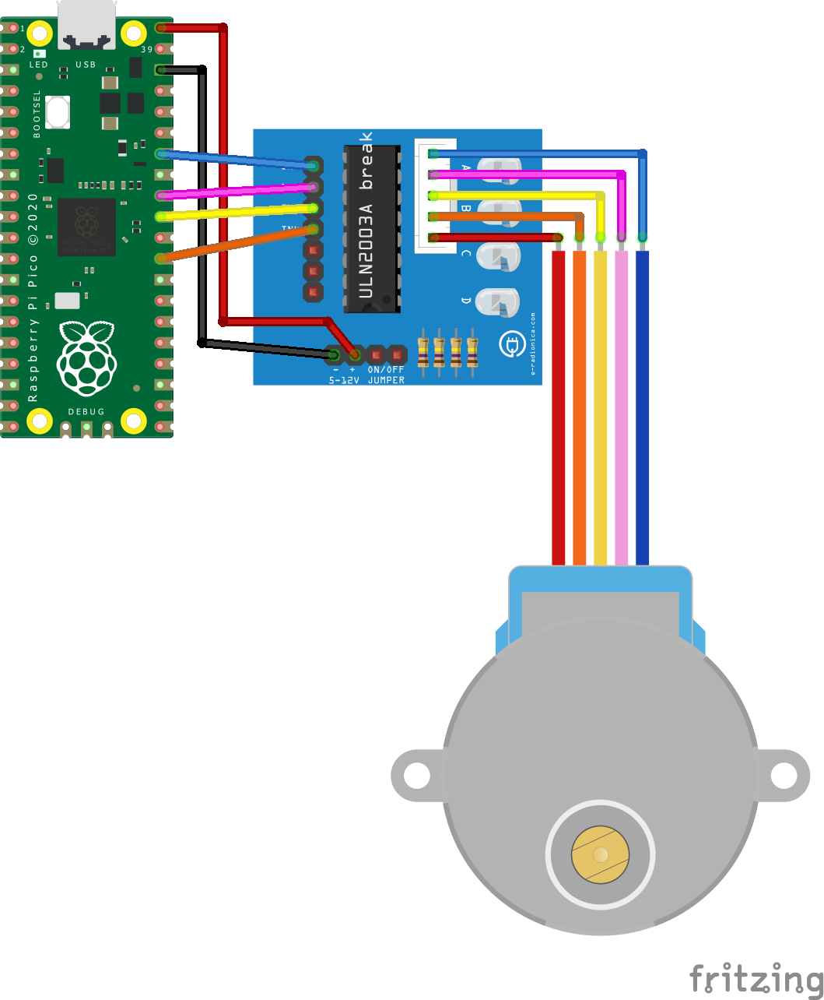

# Hardware
I staretd out developing this for a Raspberry Pi 4b.  Since I have to the Raspberry Pi Pico for a couple of reasons:

* it's cheaper
* it's easier to smaller
* it starts almost instantly
* it doesn't get as hot

You can still find the older Raspberry Pi 4b [wiring](../imsages/../images/wiring-4b.png) and [software](../src/python/stepper.py), but it is not going to be kept up to date.  At some point I'll likely drop them since the MicroPython code is different enough.

## Raspberry Pi Pico

- File: [main.py](../src/microPython/main.py)
- Config: [stepper.yaml](../src/microPython/stepper.yaml)

The code doesn't hard wire pins but you do have to configure it.  See the [Calibration](#calibration) section on why you don't need to tune the stepper delay.

So just plug in your configuration in [stepper.yaml](../src/microPython/stepper.yaml) and ship the [microPython](../src/microPython/) directory to your Raspberry Pi Pico.

How?  I will leave that to you but provide the tools I used.  I decided to go the VSCode route which is GREAT!  I have one IDE to manage the code, run it remotely on the Pico, and finally to upload it to the Pico.  The sites I found helpful:

- [Raspberry Pi Pico: Getting Started](https://www.raspberrypi.org/documentation/pico/getting-started/)
- [How To Solder Pins to Your Raspberry Pi Pico](https://www.tomshardware.com/how-to/solder-pins-raspberry-pi-pico)
- [Developing for the Raspberry Pi Pico in VS Code — Getting Started](https://medium.com/all-geek-to-me/developing-for-the-raspberry-pi-pico-in-vs-code-getting-started-6dbb3da5ba97)
- [MicroPython libraries](https://docs.micropython.org/en/latest/library/index.html)

Once you get everything uploaded to the Pico it pretty much instantly starts when plugged into USB power.  The Raspberry Pi 4b I used originally took a while.  And it's cheaper, smaller, and MUCH cooler when running.

## Wiring

Pinout picked to minimize wire crossings.  It will change if I start adding some buttons.  Also I used [F-wire-blank.stl](../src/stl/F-wire-blank.stl) to make some blanks for pins not used so I could glue the wires together.  It was super annoying getting to a site to shoot and having to re-wire things!  Thankfully having this repo with pictures made it trivial, but still didn't like it.

The pinout is available on  [Raspberry Pi Pico: Getting Started](https://www.raspberrypi.org/documentation/pico/getting-started/):

And the layout I have gone with is:

---
Back to the [Index](00-index.md)!